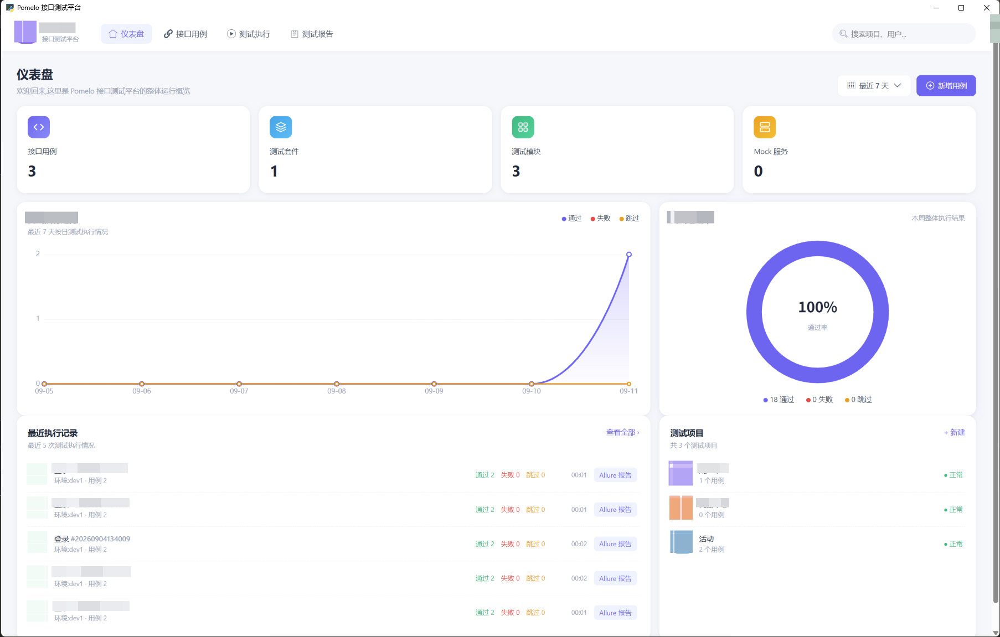
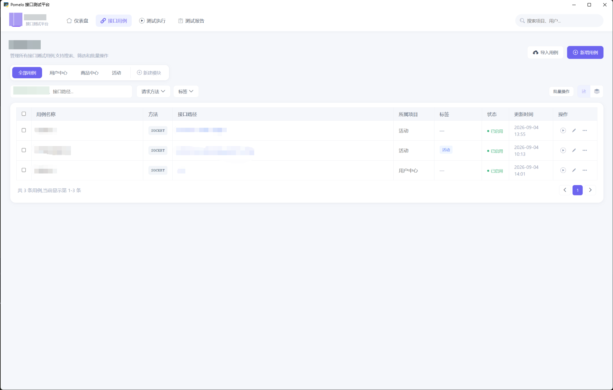
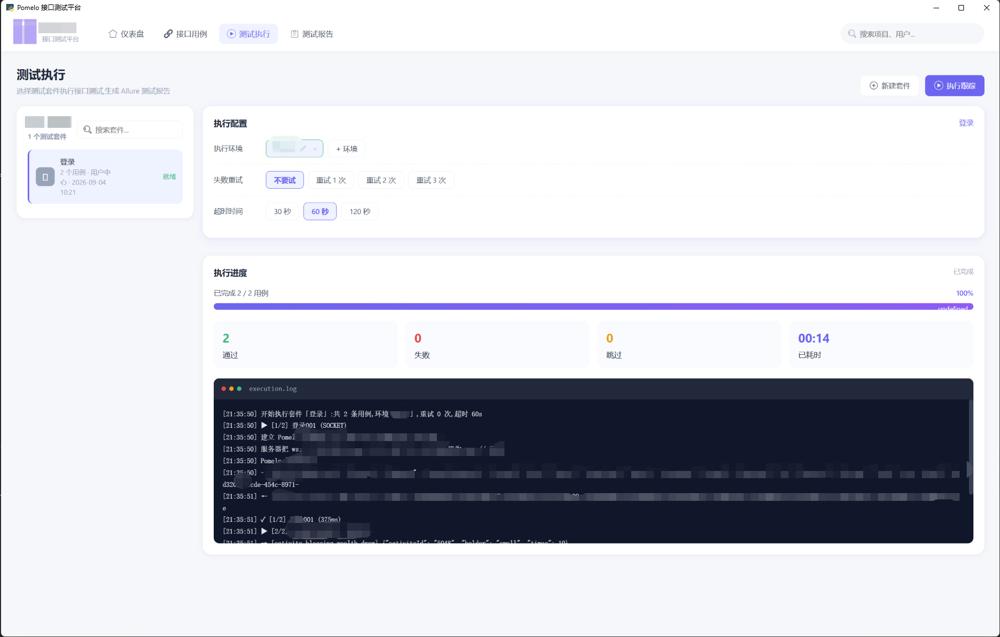
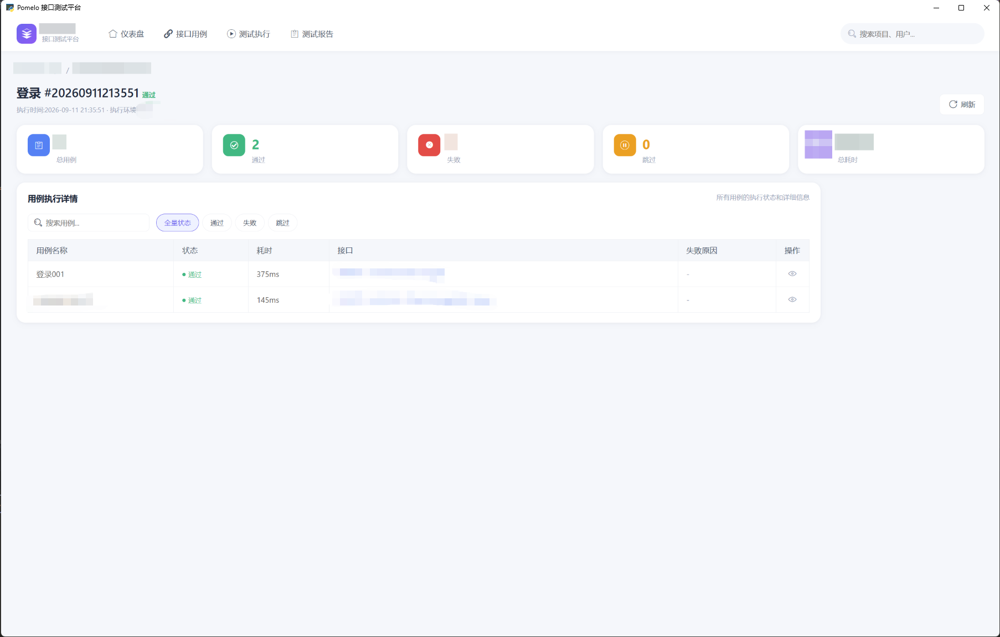
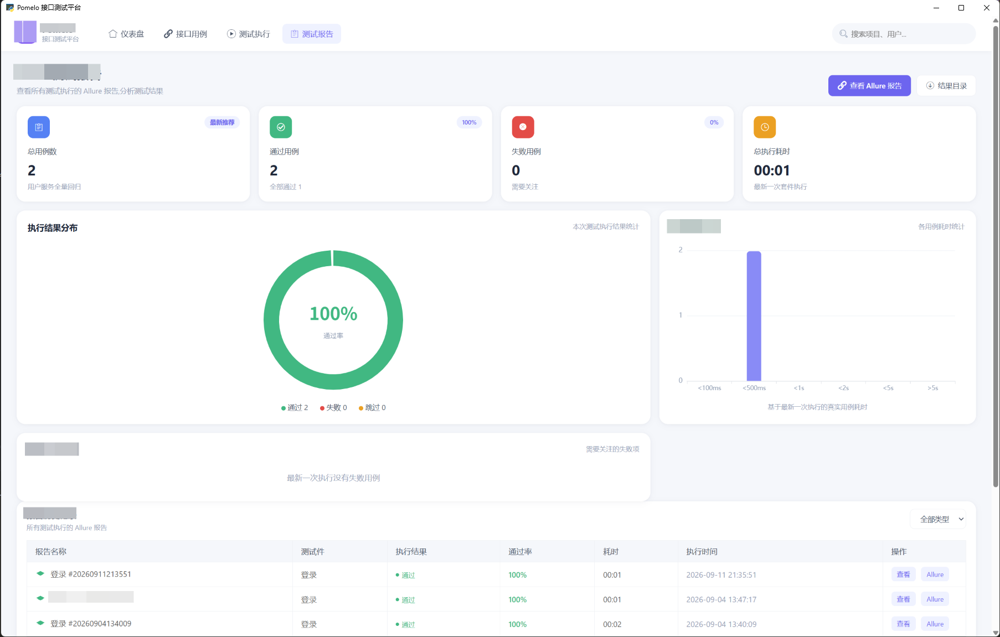
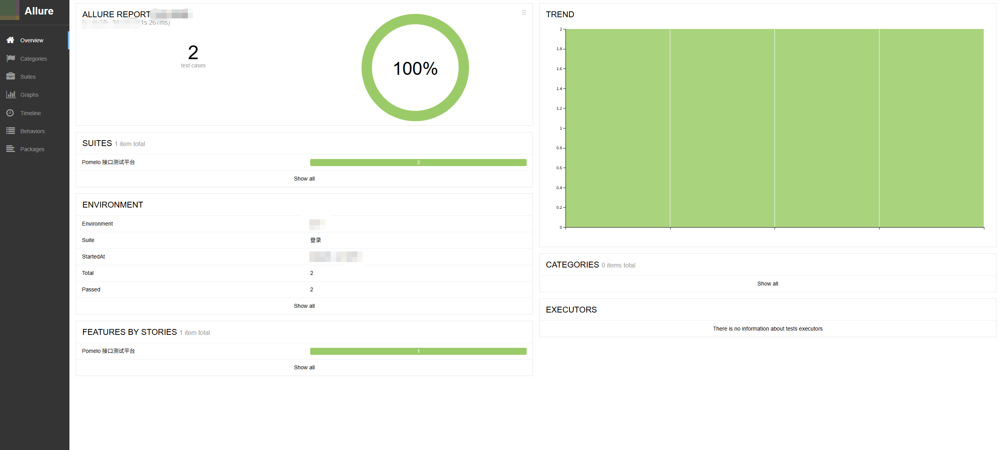

# Pomelo 接口测试平台（桌面端）

> 一款桌面端的接口测试工具：仪表盘、用例管理、套件执行、Allure 报告一站搞定。
> 纯本地运行、数据不出本机、解压即用，也支持同网段多人协作。

支持 **Windows** 与 **macOS**。发行包内置 Allure 与 Java 运行环境，**目标电脑不需要装 Java**。

## 目录

- [功能一览](#功能一览)
- [下载使用](#下载使用)
- [从源码运行](#从源码运行)
- [局域网协作](#局域网协作)
- [打包](#打包)
- [常见问题](#常见问题)

## 功能一览

顶部四个入口：**仪表盘 / 接口用例 / 测试执行 / 测试报告**；右上角是局域网访问地址条和全局搜索。

### 仪表盘



- **统计卡**：接口用例数、测试套件数、测试模块数、Mock 服务数；
- **执行趋势折线图**：支持 **最近 7 / 15 / 30 天** 切换，三条曲线分别统计失败、发送、通过；
- **通过率环形图**：整体通过率一目了然；
- **最近执行记录**：每条记录可直接跳转 Allure 报告；
- **测试项目卡片**：按模块组织，显示各自用例数与健康状态。

### 接口用例



用例按**项目模块**分 Tab 管理，支持：

- 按关键词、请求方法、标签多维筛选，批量操作；
- **HTTP 与 Socket（WebSocket）协议**用例统一管理；
- 用例编辑器：请求配置 / Headers / Params / Body（JSON · Form · Raw），右侧断言、变量、标签面板；
- **断言支持比较符**：等于、不等于、大于、大于等于、小于、小于等于、包含、不包含，期望值支持 `{{变量}}` 引用；
- **变量传递**：上游用例提取的变量（如登录态 `{{token}}`）在下游用例中直接引用，每轮迭代动态重新获取；
- **导入导出**：用例可批量导入导出，方便团队内共享；
- 同名保护：不同目录允许同名用例，编辑时精确定位，保存时同名拦截防覆盖。

### 测试执行



左侧选择测试套件，右侧配置执行参数：

- **执行环境**：多环境切换（dev / test / release）；
- **失败重试**：不重试 / 重试 1~3 次；
- **超时时间**：30s / 60s / 120s（Socket 用例另有毫秒级总超时控制）。

点击「执行套件」后进入实时执行视图：进度条 + 通过 / 失败 / 跳过 / 已耗时四项实时计数，
终端风格日志逐条滚动输出请求、连接、断言过程，定位问题不用翻文件。

### 运行详情



每次执行生成一条运行记录，点进去是用例级执行详情：总用例 / 通过 / 失败 / 跳过 / 总耗时五项统计，
每条用例的状态、耗时（ms）、所属接口、失败原因，支持状态筛选与关键词搜索。

### 测试报告（集成 Allure）



- 每次执行自动生成 Allure 报告，**按报告号归档**，历史报告随时回看，不会被下次执行覆盖；
- 报告总览：总用例数、通过 / 失败、总耗时；
- **执行结果分布环形图** + **接口耗时分布柱状图**（<100ms / <500ms / <1s / <2s / <5s / >5s 分桶）；
- 历史报告列表：来源套件、执行结果、通过率、耗时、执行时间，一键查看。

每次执行还会生成一份**完整的 Allure 原生报告**（含 Overview / Categories / Suites / Graphs / Timeline
全部分类页），点「Allure」按钮在新窗口打开：



## 下载使用

发行包是 zip，**解压即用**。

### Windows

1. 解压 `PomeloTool_v*_win64.zip`；
2. **先双击 `fix_and_check.bat` 跑一次** —— 解除 Windows 对下载文件的安全标记，并检查系统运行库版本；
3. 双击 `PomeloTool.exe` 启动。

> **为什么需要第 2 步？** 浏览器 / 微信下载的 zip 自带「Web 标记」，Windows 自带解压会把它传播到所有
> 文件，导致运行库被拦截、启动报错。bat 里那条 `Unblock-File` 就是解这个的。用 7-Zip 解压则天然无此问题。

### macOS

- Apple Silicon（M 系列）用 `*_macos_arm64.zip`，Intel 芯片用 `*_macos_x86_64.zip`，
  两者**不能混用**，装错了双击会提示「无法打开」；
- 命令行方式（首次用推荐，顺便清掉隔离标记）：

```bash
unzip -q PomeloTool_v*_macos_*.zip
xattr -cr PomeloTool.app
open PomeloTool.app
```

- 也可以直接跑：`PomeloTool.app/Contents/MacOS/PomeloTool`

### 数据备份 / 迁移

把程序目录旁的 `data/` 整个拷走即可；换台机器放回去就能接着用，首次启动会自动重建。

## 从源码运行

```bash
pip install -r requirements.txt
python pomelo_app.py        # 开发模式直接启动
```

以 1440×900 窗口启动，无需浏览器。

启动后页面右上角会出现一条**访问地址条**（如 `172.17.224.71:18080`）：
点击用系统默认浏览器打开，右侧「复制」把完整地址复制走发给同事，悬浮显示完整 URL。

> **端口不是写死的**：默认 18080；若 18080 已被占用（比如已经开着一个实例），自动改用 **18081**；
> 两个都被占用才回退到系统随机端口。以**启动日志和页面地址条显示的为准**，别在书签里写死。

浏览器预览（不起桌面窗口）：

```bash
cd web && python -m http.server 8080
# 打开 http://127.0.0.1:8080
```

界面资源已全部本地化，**离线可用**，无需联网。

## 局域网协作

一台机器启动，同网段的其他人**不用装任何东西**，浏览器打开 `http://<你的IP>:18080/index.html`
就能正常使用（看用例、改配置、跑套件、翻报告）。

首次使用需要在主机上**放行一次防火墙**（启动日志会按实际端口打印对应命令）：

Windows（管理员 PowerShell）：

```bat
netsh advfirewall firewall add rule name="PomeloTool 18080" dir=in action=allow protocol=TCP localport=18080
```

macOS：首次启动若弹出「是否允许 PomeloTool 接受传入网络连接」，选**允许**；
也可在 系统设置 → 网络 → 防火墙 → 选项 里手动放行。

如果启动时落到了 18081，规则里的端口要跟着改成 18081。

### 多人同时用之前，先知道这几条

- **执行是全局单任务**：同一时刻只允许一个套件在跑，第二个人点执行会提示「已有执行任务在进行中」；
- **执行日志是广播的**：A 执行时，停在执行页的 B 也会看到同一份实时日志，不是每人一份独立会话；
- **数据没有加锁**：多人同时改同一条用例，后保存的覆盖先保存的，建议分工而不是抢同一条；
- **没有鉴权**：同网段只要知道地址就能读写执行，仅适合可信内网；
- 服务跑在主机上，主机关机或退出软件，所有人都断。

换句话说：**适合小团队共享一份用例库、轮流执行**；想要「每人一套独立环境」或「并行跑多个套件」，
需要另行改造。

## 打包

### Windows

```bat
build_pyd.bat
```

流程：**校验便携依赖 → 装依赖 → 核心逻辑编译为二进制 → 打包成独立程序 → 捆绑 Allure / Java
运行环境 → 布局校验 → 自动压缩 zip**。产物在 `dist\PomeloTool\`。

```
dist/PomeloTool/
├── PomeloTool.exe            # 主程序（核心逻辑已编译，无源码）
├── fix_and_check.bat         # 首启环境自检 / 修复
├── _internal/                # 运行库 + 界面资源
├── tools/allure-commandline  # Allure 命令行（约 28MB）
└── tools/jre                 # 便携 Java 运行环境（约 125MB，非 JDK）
```

### macOS

```bash
chmod +x build_mac.sh     # 首次
./build_mac.sh
```

流程与 Windows 一致，另外会自动下载对应架构的 Allure 与 Java 运行环境、完成签名，
最后用 `zip -y` 压缩（`.app` 内部靠符号链接组织，丢了软链解压后无法启动，所以 `-y` 是必须的）。

产物：`dist/PomeloTool.app` 与 `PomeloTool_macOS_<日期>.zip`。

> **打包工具不支持交叉编译**：Windows 上打不出 mac 包，反之亦然。
> 想一次拿到两端产物，用 `.github/workflows/release.yml` —— 它会同时跑 Windows、
> macOS arm64、macOS x86_64 三条腿，把三个 zip 挂到同一个 Release 上。

### 便携依赖是打包的硬性要求

发行包要保证**目标机器不装 Java、不装 Allure 也能出报告**，所以这两样必须随包发出去。
打包默认**硬失败**：缺任一项直接中止，不会产出「能启动、点报告才报错」的残缺包。

| 变量 | 默认值 | 作用 |
|---|---|---|
| `ALLURE_SRC` | Windows：`C:\software\allure-2.32.0`<br>macOS：`build_tools/allure-commandline` | Allure 命令行源目录 |
| `JRE_SRC` | Windows：`C:\software\java\jre-17`<br>macOS：`build_tools/jre` | 便携 Java 运行环境源目录 |
| `SKIP_JRE=1` | 关 | 明确**不**捆绑 Java 运行环境（目标机必须自装 Java） |
| `REQUIRE_BUNDLE=0` | 关 | 缺依赖只告警、照常出包（**产物不自包含**，仅调试用） |
| `FORCE_COPY=1` | 关 | 强制重拷依赖（产物目录里已有也重来） |

打包前可以单独自检依赖，不触发构建：

```bash
python pyd_pack.py --check-deps
```

它会检查源目录结构、打印体积，并**真跑一次 `java -version`** —— 只有文件不代表能启动：
缺运行库、被安全策略拦、架构不对，都要到真正用的时候才暴露。

### 打包前的静态自检

```bash
python pyd_pack.py --check-deps    # 便携依赖是否就绪
python _mac_dryrun_check.py        # mac 分支在 Windows 上也能预检
```

`_mac_dryrun_check.py` 把系统标识临时改成 macOS，先跑一遍 mac 专属的打包路径
（是否用对了平台组件、是否生成了 `.app`、路径常量是否正确），避免低级笔误要等到
mac 机器上才炸。

## 常见问题

**启动报错 / 换电脑后打不开（Windows）**
先跑一遍 `fix_and_check.bat`；仍不行就确认解压工具用的是 7-Zip 而不是系统自带解压。

**macOS 提示「已损坏，无法打开」**
下载带来的隔离标记还没清：`xattr -cr PomeloTool.app`。

**macOS 提示「无法打开」且没有其它信息**
多半是架构装错了：M 系列芯片用 arm64 包，Intel 用 x86_64 包。

**同事连不上局域网地址**
先确认主机防火墙已放行（命令见上文），再用**启动日志里打印的端口**——可能已经回退到 18081。

**想换台机器继续用**
把程序目录旁的 `data/` 整个拷过去即可。

## 路线图

- [ ] 定时任务调度（cron / 一次性 ETA 触发）
- [ ] Mock 服务
- [ ] 多平台通知（飞书 / 钉钉 / 企业微信）
- [ ] 环境变量组管理增强
